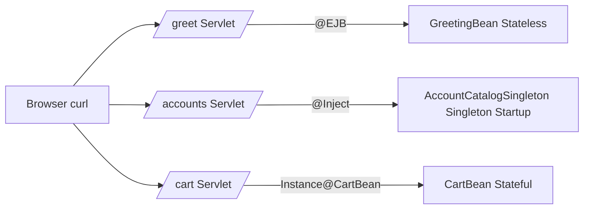

# Lesson 1 - EJB Refresher

> **Goal:** refresh the three session bean types (`@Stateless`, `@Stateful`, `@Singleton`), how to wire them to a Servlet, how the container manages their lifecycle, and the **pitfalls** that trip people up in interviews.

## What you'll build

Three beans and three servlets on WildFly:



| Bean | Type | Concurrency | Lifetime |
| --- | --- | --- | --- |
| `GreetingBean` | `@Stateless` | container pools, one caller per instance | lives in the pool, recycled |
| `CartBean` | `@Stateful` | container serializes calls from the one client | per client; removed by `@Remove` or `@StatefulTimeout` |
| `AccountCatalogSingleton` | `@Singleton @Startup` | `CONTAINER` `@Lock(READ/WRITE)` | one per JVM, forever |

## Run it

```bash
# provision WildFly + deploy + keep running
mvn -q clean wildfly:package wildfly:dev

# then:
curl 'http://localhost:8080/banking-lesson-01-refresher/greet?name=Ada'
curl 'http://localhost:8080/banking-lesson-01-refresher/accounts?number=GB29NWBK60161331926819'

# stateful cart (persistent cookies required):
curl -c c.txt -b c.txt -X POST 'http://localhost:8080/banking-lesson-01-refresher/cart?sku=ABC'
curl -c c.txt -b c.txt -X POST 'http://localhost:8080/banking-lesson-01-refresher/cart?sku=DEF'
curl -c c.txt -b c.txt       'http://localhost:8080/banking-lesson-01-refresher/cart'
curl -c c.txt -b c.txt -X POST 'http://localhost:8080/banking-lesson-01-refresher/cart?action=checkout'
```

## Arquillian integration test

```bash
mvn -q -Pit verify
```

The test (`Lesson01IT`) provisions WildFly, deploys a minimal `WebArchive`
with only the three beans, and asserts that:

1. The `@Stateless` bean answers a method call.
2. The `@Startup @Singleton` has already been initialized by the time the
   first test runs (seeded on `@PostConstruct`).
3. The `@Stateful` bean keeps state across multiple method calls and is
   cleared after `@Remove`.

## JNDI: what the container registers for you

When WildFly deploys `lesson01.war` it registers portable JNDI names for
every session bean. For `GreetingBean` they are:

```
java:global/banking-lesson-01-refresher/GreetingBean
java:global/banking-lesson-01-refresher/GreetingBean!org.ejblab.banking.l01.GreetingBean
java:app/banking-lesson-01-refresher/GreetingBean
java:module/GreetingBean
```

You can look one up manually:

```java
var ctx = new InitialContext();
var bean = (GreetingBean) ctx.lookup("java:module/GreetingBean");
```

But `@Inject` / `@EJB` are better: they fail at deploy time if the bean is
missing, whereas a JNDI string fails at runtime.

## Pitfalls & anti-patterns

1. **Don't `new` an EJB.** `new GreetingBean()` yields an unmanaged instance
   - no interceptors, no transactions, no injection. A subtle bug is
   instantiating a Stateless bean in a unit test and then being surprised
   when `@Inject EntityManager` is null.

2. **Self-invocation skips interceptors.** If `hello(...)` calls
   `this.helper(...)` inside `GreetingBean`, any interceptor or
   `@TransactionAttribute` on `helper` is **ignored** because the call
   doesn't go through the container proxy. Lesson 3 shows the fix via
   `SessionContext.getBusinessObject(...)`.

3. **`@Stateful` without `@Remove` leaks.** Until `@StatefulTimeout` fires,
   the container keeps the instance + associated state. In a high-traffic
   app this fills the passivation store.

4. **`@Singleton` default `@Lock(WRITE)` caps throughput at one caller.**
   Every method in a `@Singleton` defaults to `WRITE` - annotate read-only
   methods `@Lock(READ)` or switch to `ConcurrencyManagementType.BEAN`.

5. **`@Stateful` is NOT the right scope for HTTP sessions.** CDI
   `@SessionScoped` is much simpler if you just need per-HTTP-session
   state. Use `@Stateful` when you need EJB services (TX, security,
   passivation, remote access) tied to a conversation.

6. **No-interface view vs `@Local` vs `@Remote`.** No-interface view is
   fine for intra-module local clients. Use `@Local` to hide a bean
   behind an interface. `@Remote` serializes arguments (Lesson 9).

## Interview Q&A

**Q1. When would you choose `@Stateful` over CDI `@SessionScoped`?**
A. When you need EJB container services (container-managed TX,
`@RolesAllowed`, `@Schedule`, `@Asynchronous`, passivation, `@Remove`,
remote access) keyed to a specific client conversation. For simple HTTP
session scoping in a web app, CDI is preferred - less overhead, no
passivation machinery.

**Q2. What does the container do when a `@Stateless` pool is exhausted?**
A. By default (`strict-max-pool`) the caller blocks until a permit is
available or `instance-acquisition-timeout` expires; in the latter case
an `EJBException` is thrown. You can tune `max-pool-size` in the
`ejb3` subsystem. Pool size vs throughput is a Lesson 12 benchmark.

**Q3. Are Stateless bean instance fields safe to use?**
A. They're safe in the sense that the container won't let two threads
use the same instance simultaneously, so there's no race. But fields
persist across calls on the same instance, so treating them like
"scratch variables" can leak state between unrelated callers. The
convention is to keep Stateless beans effectively stateless.

**Q4. What is the difference between `@Inject` and `@EJB`?**
A. `@Inject` is CDI and works for any managed bean (CDI beans + session
beans, which are implicit CDI beans). `@EJB` is the EJB-spec
injection annotation; it works only for session beans and supports
`mappedName`/`lookup` strings. New code should prefer `@Inject`.

**Q5. Why does the `@Singleton` here declare `@Startup`?**
A. Without it, the singleton is lazily instantiated on first use.
`@Startup` eagerly initializes at deploy; useful for cache priming,
registration with external systems, or verifying that required
resources (DB, JMS) are healthy before accepting traffic.

## Benchmark notes

- For a pure in-memory `GreetingBean`, p50 latency over HTTP on a
  laptop lands around 1-2 ms on WildFly. Most of it is the servlet +
  HTTP stack, not EJB. Profile with JFR; the EJB proxy cost is
  dominated by the HTTP parsing.
- For `AccountCatalogSingleton`, compare two configurations:
  1. `@Lock(READ)` on `ownerOf` (the default in our code)
  2. Without it (falls back to `WRITE`)
  Under 16 concurrent readers, `READ` throughput is ~N× higher where
  N is the number of cores; `WRITE` collapses to strictly sequential.
- Lesson 4 repeats this benchmark with JMH-style numbers and shows the
  `BEAN`-managed (`ReadWriteLock`) version.

## What's next

[Lesson 2 - JPA + Container-Managed Transactions](../banking-lesson-02-jpa-cmt):
swap the in-memory catalog for a real Postgres-backed `AccountRepository`.
