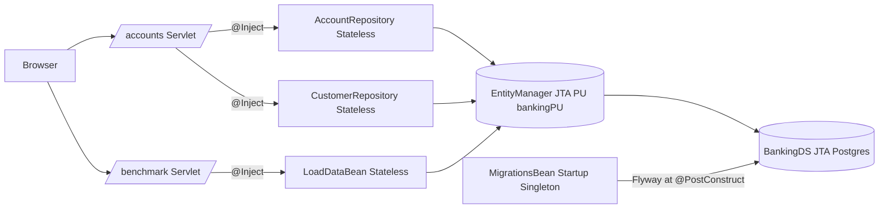

# Lesson 2 - JPA + Container-Managed Transactions

> **Goal:** wire EJBs to a real Postgres database using JPA and
> container-managed transactions, run schema migrations at deploy time,
> and understand the "when does the transaction commit?" question cold.

## What you'll build



## Prerequisites

Start Postgres:

```bash
docker compose -f ../docker/docker-compose.yml up -d postgres
```

## Run it

```bash
mvn -q clean wildfly:package wildfly:dev

# Create a customer + account:
curl -X POST 'http://localhost:8080/banking-lesson-02-jpa-cmt/accounts?owner=Ada&email=ada@bank.io&balance=250.00'

# List:
curl  'http://localhost:8080/banking-lesson-02-jpa-cmt/accounts'
```

## Key file tour

| File | Why it's interesting |
| --- | --- |
| [`persistence.xml`](./src/main/resources/META-INF/persistence.xml) | `transaction-type="JTA"` with `jta-data-source` pointing at the WildFly-registered DS. Hibernate is in `validate` mode because Flyway owns the schema. |
| [`V1__baseline.sql`](./src/main/resources/db/migration/V1__baseline.sql) | The entire Lesson 2 schema, in one migration. Subsequent lessons add `V2__...`, `V3__...`. |
| [`MigrationsBean`](./src/main/java/org/ejblab/banking/l02/MigrationsBean.java) | `@Startup @Singleton` + `TransactionManagementType.BEAN` so Flyway owns its own TXs. |
| [`AccountRepository`](./src/main/java/org/ejblab/banking/l02/AccountRepository.java) | Shows `REQUIRED` (default) + a `MANDATORY` + `PESSIMISTIC_WRITE` method used by Lesson 3. |
| [`LoadDataBean`](./src/main/java/org/ejblab/banking/l02/LoadDataBean.java) | `REQUIRES_NEW` forces a fresh TX; uses Hibernate batch inserts. |

## The "when does it commit?" cheat sheet

When you call `accountRepo.save(new Account(...))` from a servlet:

1. Servlet has no JTA TX, so the container starts one on entering the
   `@Stateless` bean (because `@TransactionAttribute` defaults to
   `REQUIRED`).
2. `EntityManager.persist(...)` schedules an `INSERT`. Nothing hits the DB
   yet unless you call `em.flush()` or the query processor needs to
   flush.
3. On method return, the container commits the TX. That's when the
   `INSERT` actually executes (auto-flush on commit).
4. On exception: runtime exceptions roll back; checked exceptions commit
   unless `@ApplicationException(rollback=true)`.

## Pitfalls & anti-patterns

1. **Detached entities after method return.** The `EntityManager`'s
   persistence context is TX-scoped. Any entity you return to the
   servlet is **detached** - lazy associations cannot be loaded. Fix
   options: initialize inside the TX (`Hibernate.initialize(a.getOwner())`),
   use a DTO, or use a fetch-join JPQL.

2. **`em.flush()` inside a loop "to save memory" but forgetting
   `em.clear()`.** The session grows unbounded and OOMs. Always pair
   `flush()` with `clear()` in batch writes.

3. **N+1 queries from lazy toMany associations.** Fetch-join or `@EntityGraph`
   in queries that iterate. Lesson 10 shows a fetch-join on `Transfer`.

4. **Starting your own TX with `UserTransaction` inside a CMT bean.**
   Illegal - throws. Either switch to `TransactionManagementType.BEAN` or
   use `REQUIRES_NEW`.

5. **Schema managed by Hibernate `update` in production.** Feels
   convenient in demos; wrecks production when a field is renamed.
   Keep Hibernate at `validate`, let Flyway (or Liquibase) own the DDL.

6. **Treating `EntityManager` like a thread-safe singleton.** It is NOT.
   In our repos, the container injects a proxy that resolves to a new
   EM per TX. Never hold onto one across threads.

## Benchmark: batch insert vs one-per-TX

Laptop, Postgres 16 in Docker, `-Xmx1g`, WildFly 36:

| Mode | n | duration | rows/s |
| --- | --- | --- | --- |
| Batch (`insertBatch`, one TX, batch_size=50) | 1,000 | ~110 ms | ~9,000 |
| One-per-TX (`insertOnePerTx`, 1,000 TXs) | 1,000 | ~1,600 ms | ~620 |

The 15x gap is the per-transaction cost (fsync + network round-trips),
not EJB. Lesson 3 drills deeper.

Reproduce:

```bash
curl 'http://localhost:8080/banking-lesson-02-jpa-cmt/benchmark/batch?n=1000'
curl 'http://localhost:8080/banking-lesson-02-jpa-cmt/benchmark/one-per-tx?n=1000'
```

## Interview Q&A

**Q1. What's the difference between an `@PersistenceContext` with type
`TRANSACTION` vs `EXTENDED`?**
A. `TRANSACTION` (default) = one EM per active JTA transaction, closed
at commit. Safe in Stateless beans. `EXTENDED` = EM lives for the
lifetime of a Stateful bean (spans multiple TXs). Useful for wizards
where you want entities to remain managed across conversation steps.
Illegal in Stateless beans.

**Q2. Why is `em` field injection safe in a Stateless bean, given EMs
are not thread-safe?**
A. The container injects a **proxy** that delegates to the correct
per-TX EM. At any point, only one thread is using a given bean
instance anyway (Stateless = pooled, instance not shared). So the
thread-safety concern never materializes.

**Q3. You call `em.persist(account)`, check the DB - no row. Why?**
A. Persist is schedule-only. It's flushed on commit, on a query that
requires it, or on explicit `em.flush()`. In a CMT method, commit
happens when the method returns without a rollback trigger.

**Q4. How do you migrate schema safely at deploy?**
A. Two patterns: (a) Flyway / Liquibase driven from app startup
(`@Startup @Singleton`, what we do here); (b) run migrations as a
separate step in CI/CD before deployment. (b) is safer in a multi-node
cluster because only one runner migrates. See Lesson 6 (timers) for
the leader-election pattern you'd combine with (a).

**Q5. Why `BigDecimal` for money, not `double`?**
A. Binary floating-point can't exactly represent most decimal
fractions, so summing debits/credits accumulates error and fails
audits. `BigDecimal` with fixed scale is the only safe choice in a
ledger.

## What's next

[Lesson 3 - Transactions Deep Dive](../banking-lesson-03-transactions):
all six `TransactionAttributeType`s, BMT, the self-invocation pitfall,
and a SERIALIZABLE retry loop.
