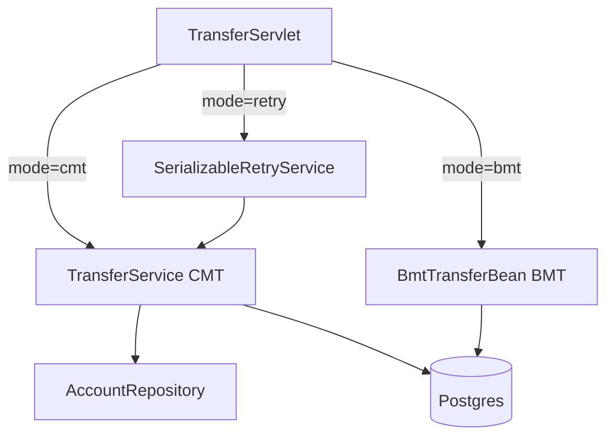

# Lesson 3 - Transactions Deep Dive

> **Goal:** answer every transaction question an interviewer can throw at
> you. All six `TransactionAttributeType`s demonstrated on one service,
> BMT shown side-by-side, rollback rules, the self-invocation pitfall,
> and a real-world SERIALIZABLE retry loop.

## TL;DR table

| Attribute | Caller has TX? | Container action | Typical use |
| --- | --- | --- | --- |
| `REQUIRED` (default) | yes | join | no | start new | almost always |
| `REQUIRES_NEW` | suspend caller, start new | "audit trail that must survive rollback" |
| `MANDATORY` | yes | join | no | throw `EJBTransactionRequiredException` | helper methods that must run in a TX |
| `NEVER` | no | run | yes | throw `EJBException` | long-running batch outside TX |
| `NOT_SUPPORTED` | suspend caller | read-only expensive work |
| `SUPPORTS` | join if present, otherwise no TX | rarely useful - caller-dependent behavior |

## Rollback rules

| Thrown | Default TX behavior |
| --- | --- |
| `RuntimeException` (or subclass) | rollback |
| Checked `Exception` | **commit** (gotcha!) |
| Anything annotated `@ApplicationException(rollback=true)` | rollback |
| Anything annotated `@ApplicationException(rollback=false)` | commit (never rollback) |
| Call to `ctx.setRollbackOnly()` | rollback (regardless of exception) |

See [`InsufficientFundsException`](../banking-domain/src/main/java/org/ejblab/banking/domain/InsufficientFundsException.java) -
a runtime exception **also** annotated `@ApplicationException` so the
rollback semantics are explicit for any reader.

## What you'll build



## Run it

```bash
docker compose -f ../docker/docker-compose.yml up -d postgres
mvn -q clean wildfly:package wildfly:dev

# seed two accounts at 1000.00 each
curl -X POST http://localhost:8080/banking-lesson-03-transactions/seed

# classic CMT transfer
curl -X POST 'http://localhost:8080/banking-lesson-03-transactions/transfer?from=ACC-001&to=ACC-002&amount=100'

# BMT version
curl -X POST 'http://localhost:8080/banking-lesson-03-transactions/transfer?mode=bmt&from=ACC-001&to=ACC-002&amount=50'

# retry-aware CMT (drives SerializableRetryService)
curl -X POST 'http://localhost:8080/banking-lesson-03-transactions/transfer?mode=retry&from=ACC-001&to=ACC-002&amount=10'
```

## The self-invocation pitfall (read this!)

Open [`TransferService`](./src/main/java/org/ejblab/banking/l03/TransferService.java)
and find `transferBuggyAudit` vs `transferWithCorrectAudit`.

```java
// Broken: bypasses EJB proxy, so @TransactionAttribute(REQUIRES_NEW) is IGNORED
public void transferBuggyAudit(...) {
    transfer(...);
    this.auditLog(...);    // <-- same TX as transfer()!
}

// Correct: re-enters via the container proxy
public void transferWithCorrectAudit(...) {
    var self = ctx.getBusinessObject(TransferService.class);
    self.transfer(...);
    self.auditLog(...);    // <-- REQUIRES_NEW honoured
}
```

This is probably the #1 cause of "my audit log vanished when the
transfer rolled back" in real code.

**Why does this happen?** CMT is implemented via an interceptor on the
EJB proxy. When you call `this.foo()`, the JVM calls the bean instance
directly, skipping the proxy - and thus skipping interceptors.
Any CDI / Spring `@Transactional` has the exact same gotcha.

## BMT vs CMT

```java
@Stateless
@TransactionManagement(TransactionManagementType.BEAN)
public class BmtTransferBean {
    @Resource UserTransaction utx;
    // utx.begin(); ... utx.commit(); ... utx.rollback();
}
```

- Use BMT only when you need to span multiple small TXs in one call
  (bulk import committing every 1,000 rows is the canonical example).
- You own rollback correctness - forgetting `utx.rollback()` in a catch
  block leaks the TX until the server times it out.

## Isolation levels and Postgres SERIALIZABLE retries

Postgres on SERIALIZABLE can abort a TX with SQLSTATE `40001`
("serialization failure"). The application's correct response is **retry
the whole transaction** up to a limit with exponential backoff.

Structure:

```java
for (int attempt = 1; attempt <= MAX; attempt++) {
    try {
        transferService.transfer(...);   // starts REQUIRED -> new TX
        return;
    } catch (RuntimeException e) {
        if (!isSerializationFailure(e) || attempt == MAX) throw e;
        sleep(backoffMs(attempt));
    }
}
```

Two subtle points:

1. The retry loop **must be outside** the TX, so the retry method uses
   `@TransactionAttribute(NOT_SUPPORTED)`. Each `transfer()` call then
   starts its own fresh TX via its `REQUIRED`.
2. We detect the error by walking the cause chain looking for
   `SQLException.getSQLState()` - we do NOT import `PSQLException` so
   the Postgres driver stays a WildFly module, not a WAR dependency.

To force a SERIALIZABLE at the datasource level, add
`transaction-isolation="TRANSACTION_SERIALIZABLE"` to the DS in
[`scripts/wildfly/datasource.cli`](../scripts/wildfly/datasource.cli).

## Distributed transactions (XA) in 60 seconds

Two resources in one TX (e.g. JDBC + JMS, or two different databases)
require an **XA** datasource. WildFly's transaction manager (Narayana)
coordinates two-phase commit:

1. Prepare: every resource votes commit or abort.
2. Commit: if all vote commit, each resource commits. If any votes
   abort, everyone rolls back.

The lab uses XA in Lesson 7 (MDB + JDBC). See `BankingXADS` in
[`datasource.cli`](../scripts/wildfly/datasource.cli).

Pitfall: XA is slow (2x round-trips) and prone to in-doubt TXs after
crashes. Prefer local + outbox pattern unless you truly need XA.

## Interview Q&A

**Q1. Walk me through what `REQUIRES_NEW` does.**
A. Suspends the current TX (saves it in the TX manager's thread state),
starts a fresh TX for this method, runs the method, commits or rolls
back the new TX, then resumes the suspended TX. Resources enlisted in
either TX are separate.

**Q2. Checked exception and no `@ApplicationException`: what happens to
the TX?**
A. It commits. This is the opposite of runtime exceptions, and the
opposite of what most developers expect. Annotate your checked
exceptions with `@ApplicationException(rollback=true)` or convert them
to runtime exceptions.

**Q3. You call `this.otherMethod()` inside the same bean. Why don't its
`@TransactionAttribute` / `@RolesAllowed` / interceptors apply?**
A. Because the EJB container implements them via a proxy; calling
`this.` bypasses the proxy. Fix by injecting `SessionContext` and
using `ctx.getBusinessObject(MyBean.class).otherMethod()`, or by
splitting the method into another bean.

**Q4. Why is SUPPORTS dangerous?**
A. The method's TX semantics depend on the caller: joined TX vs no TX
at all. Behavior differs in tests vs production. Make it explicit
(REQUIRED or NOT_SUPPORTED) and don't rely on the caller.

**Q5. When would you pick BMT over CMT?**
A. When you need to commit or roll back at a boundary finer than the
method. Bulk import with periodic commit, a job that should commit
each successful item regardless of its siblings, or when integrating
with a third-party library that manages its own transaction state.

**Q6. Row-level locking - pessimistic vs optimistic, in EJB?**
A. Pessimistic = `em.lock(entity, LockModeType.PESSIMISTIC_WRITE)` or
`SELECT ... FOR UPDATE` via JPQL with a lock mode. Optimistic =
`@Version` field; conflicts throw `OptimisticLockException` which the
container translates to a rollback. Prefer optimistic + retry for
short TXs; pessimistic when contention is guaranteed (e.g. hot-row
counters). Lesson 11 shows the retry interceptor.

## What's next

[Lesson 4 - Concurrency & Async](../banking-lesson-04-concurrency):
`@Lock` on `@Singleton`, `@Asynchronous`, `ManagedExecutorService`, and
a rate limiter for the transfer endpoint.
