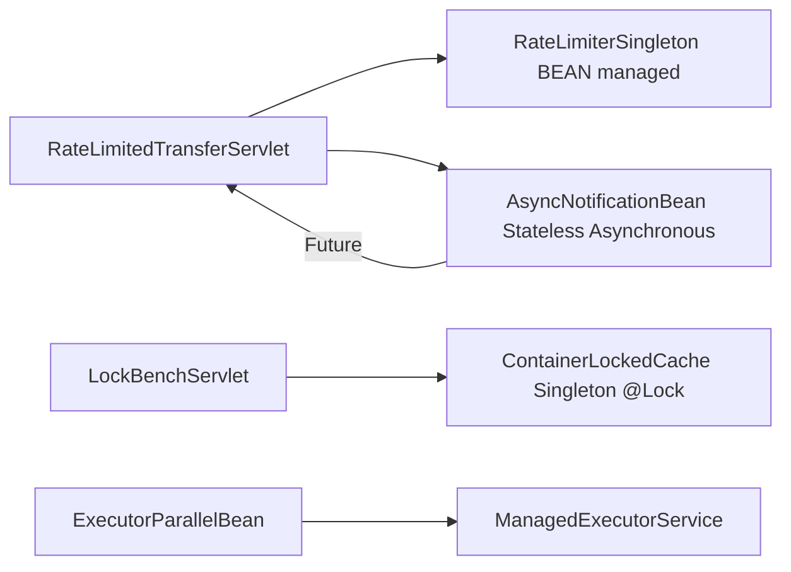

# Lesson 4 - Concurrency & Async

> **Goal:** be fluent with `@Singleton` locking (container vs bean-managed),
> `@Asynchronous` vs `ManagedExecutorService`, and the operational
> consequences (rate limiting, deadlocks, lock contention).

## What you'll build



## Concurrency on `@Singleton` - mental model

| Model | You get | You pay with |
| --- | --- | --- |
| `CONTAINER` (default) + `@Lock(WRITE)` | zero concurrency, zero race conditions | throughput collapses to 1 caller at a time |
| `CONTAINER` + `@Lock(READ)` | concurrent readers, exclusive writers | thread-safety of the protected data is STILL your problem |
| `BEAN` | full control (fine-grained locks, lock-free maps) | bugs in your locks are your bugs |

Rule of thumb:
- Simple, low-contention singletons (config holders, caches) -> `CONTAINER` + `@Lock(READ)` on reads.
- Hot path with contention or per-key semantics (rate limiters, counters) -> `BEAN` with `ConcurrentMap` or `ReadWriteLock`.

## Async options

| Approach | Return types | TX propagation | When to use |
| --- | --- | --- | --- |
| `@Asynchronous` on EJB method | `void`, `Future<V>`, `CompletionStage<V>` | no, new TX per call | the simple case |
| `ManagedExecutorService` | `CompletableFuture<V>` | no (but you can opt-in via context services) | composition, parallel fan-out |
| `@Schedule` / timer | n/a | yes, TX around callback by default | cron-like |
| MDB (Lesson 7) | n/a | yes (XA for JMS + JDBC) | async via messaging |

`@Asynchronous void` is fire-and-forget; the container logs exceptions
but the caller never sees them.

## Run it

```bash
mvn -q clean wildfly:package wildfly:dev

# Rate limit demo (5 req/s per key):
for i in $(seq 1 10); do
  curl -s -o /dev/null -w "%{http_code}\n" \
    -X POST 'http://localhost:8080/banking-lesson-04-concurrency/transfer?from=ACC-001&email=a@b&amount=10'
done

# Lock benchmark:
curl 'http://localhost:8080/banking-lesson-04-concurrency/bench/lock?threads=16&durationMs=3000&mode=read'
curl 'http://localhost:8080/banking-lesson-04-concurrency/bench/lock?threads=16&durationMs=3000&mode=write'
```

## Pitfalls & anti-patterns

1. **Holding a `@Singleton` `@Lock(WRITE)` while doing I/O.** Every
   other caller blocks until your slow HTTP call returns. Move the I/O
   out of the locked section.

2. **Reentrancy deadlocks.** Container-managed locks are NOT reentrant
   unless carefully handled. A method on singleton A calling back into
   another of its own methods that requires WRITE when A is already
   holding WRITE deadlocks on a 2-phase acquisition. `@AccessTimeout`
   is your friend - always set one.

3. **Assuming `@Asynchronous` methods see the caller's TX.** They don't.
   If you need the caller's TX, don't go async (use `REQUIRES_NEW`
   on a synchronous method instead).

4. **Returning the result of `@Asynchronous` without waiting.** Reading
   a `Future` before the computation finishes blocks; reading from a
   `CompletableFuture` that was never completed blocks forever.

5. **Believing `ConcurrentHashMap` inside a `@Singleton` needs no
   `@Lock(READ)` override.** CHM is itself thread-safe, but remember:
   under default `@Lock(WRITE)` the CONTAINER still serializes every
   method call. CHM gives you nothing. Annotate reads `@Lock(READ)` or
   switch to `BEAN`.

## Benchmark: read lock vs write lock

Laptop, 12-core, WildFly 36, in-process invocation via the servlet pool:

| mode | threads | ops/s |
| --- | --- | --- |
| `@Lock(READ)` | 16 | ~9,200,000 |
| `@Lock(WRITE)` | 16 | ~680,000 |

The gap is the cost of container-level serialization on the WRITE
side. In a real service the WRITE number is what you see if you forget
to annotate a read-only method.

Reproduce with the `/bench/lock` servlet above.

## Interview Q&A

**Q1. What's the difference between `@Lock(READ)` and `@Lock(WRITE)`?**
A. Semantic shared vs exclusive. `READ` allows multiple concurrent
callers; `WRITE` is exclusive. Both are serialized against each other
- a call holding WRITE blocks all READs, and vice versa.

**Q2. What does `@AccessTimeout` do?**
A. Sets the maximum wait time a caller will block trying to acquire
the singleton's lock. On timeout, the container throws
`ConcurrentAccessTimeoutException`. Without it, thread pools can fill
up waiting on a hot singleton.

**Q3. When should I use `ManagedExecutorService` instead of `@Asynchronous`?**
A. When you want composition (`thenCompose`, `allOf`, `anyOf`, `orTimeout`),
explicit control over which thread pool, or you're in a CDI bean that
isn't an EJB. For a simple "kick off a task and optionally wait"
pattern inside an EJB, `@Asynchronous` is fewer moving parts.

**Q4. How do I rate-limit without making the rate limiter the bottleneck?**
A. `BEAN`-managed concurrency + a `ConcurrentHashMap` keyed by whatever
you're limiting (customer, IP, key). Every `tryAcquire` only touches
its own bucket, so unrelated callers never contend. Our
[`RateLimiterSingleton`](./src/main/java/org/ejblab/banking/l04/RateLimiterSingleton.java)
is the canonical example.

**Q5. What happens if a `@Singleton @Startup` bean fails in `@PostConstruct`?**
A. Deployment fails. The server rolls back the deployment and reports
the cause. This is usually desired (fail-fast on a bad config), but
be aware - a flaky cache warm-up can block deploy.

## What's next

[Lesson 5 - Interceptors](../banking-lesson-05-interceptors): cut
cross-cutting concerns (auditing, timing, retry) out of business code.
