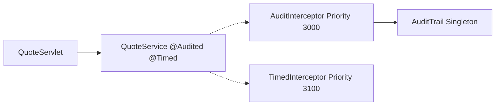

# Lesson 5 - Interceptors

> **Goal:** cleanly decorate business methods with cross-cutting concerns
> (audit, timing, retry, tracing) without junking up the business logic.

## Three flavors, one mental model

| Flavor | Activation | Target scope |
| --- | --- | --- |
| CDI `@InterceptorBinding` + `@Interceptor` | annotate method/class with the binding | CDI beans + EJBs |
| `@Interceptors(X.class)` | on EJB class/method | EJB only (older, still valid) |
| Default interceptors | listed in `beans.xml` as `<class>` under `<interceptors>` | applies to every bean not excluded |

All three hit the SAME callback hooks:

| Hook | Fires on |
| --- | --- |
| `@AroundInvoke` | business method call |
| `@AroundConstruct` | bean constructor |
| `@AroundTimeout` | EJB timer callback (Lesson 6) |
| `@PostConstruct` / `@PreDestroy` | bean lifecycle callbacks |

## What you'll build



## Key files

| File | Why |
| --- | --- |
| [`Audited.java`](./src/main/java/org/ejblab/banking/l05/Audited.java) | `@InterceptorBinding` - the tag you annotate business code with |
| [`AuditInterceptor.java`](./src/main/java/org/ejblab/banking/l05/AuditInterceptor.java) | `@Interceptor` + `@Priority(3000)` - the handler |
| [`TimedInterceptor.java`](./src/main/java/org/ejblab/banking/l05/TimedInterceptor.java) | `@AroundInvoke` + `@AroundTimeout` |
| [`LifecycleLoggingInterceptor.java`](./src/main/java/org/ejblab/banking/l05/LifecycleLoggingInterceptor.java) | `@AroundConstruct` via `@Interceptors` |
| [`beans.xml`](./src/main/webapp/WEB-INF/beans.xml) | enables the interceptor list |

## Ordering

Interceptors run as a stack:

```
AuditInterceptor.around()     (priority 3000)   <-- enters
  TimedInterceptor.around()   (priority 3100)   <-- enters
    <business method body>
  TimedInterceptor.around()                     <-- returns
AuditInterceptor.around()                       <-- returns
```

Lower `@Priority` = wraps around higher ones (runs first in, last out).
Platform services (transactions, security) sit at 1xxx, which means
they wrap around application interceptors - so by the time your
interceptor runs, the TX has already started.

## Run it

```bash
mvn -q wildfly:dev
curl 'http://localhost:8080/banking-lesson-05-interceptors/quote?amount=1000'
curl 'http://localhost:8080/banking-lesson-05-interceptors/quote/fx?from=USD&to=EUR'
curl 'http://localhost:8080/banking-lesson-05-interceptors/quote/broken'
curl 'http://localhost:8080/banking-lesson-05-interceptors/audit'   # dump trail
```

## Pitfalls & anti-patterns

1. **Forgetting `ctx.proceed()`**. Returns null, business logic never
   runs, no error visible. Easy to miss in refactors.

2. **Catching exceptions and not rethrowing.** An interceptor that
   swallows the exception breaks rollback semantics and masks bugs.
   Log and rethrow (or wrap).

3. **Binding + activation confusion.** Declaring `@Audited` + writing
   the interceptor isn't enough - the interceptor must be enabled,
   either by `@Priority` (CDI 2.0+) or `<interceptors>` in `beans.xml`.
   If the interceptor doesn't fire, 90% of the time activation is
   missing.

4. **Assuming `@AroundInvoke` catches timer callbacks.** It doesn't.
   Use `@AroundTimeout` in the same class, or metrics/audits silently
   stop at scheduled jobs.

5. **Long-running work in an interceptor.** Every business method
   call pays the cost. Trim the interceptor body, or move heavy work
   to an `@Asynchronous` side channel.

6. **Servlet filter vs interceptor vs EJB listener.** They solve
   different layers:
   - **Servlet filter**: HTTP request, before any bean is invoked.
   - **EJB interceptor**: around a bean method call (including
     internal-to-bean calls).
   - **JAX-RS filter / CDI event observer**: REST layer concerns.

## Interview Q&A

**Q1. How is interceptor ordering determined?**
A. Among interceptors bound to the same method, `@Priority` decides:
lower priority wraps higher priority (runs first on entry, last on
exit). Without `@Priority`, `beans.xml` `<interceptors>` order
controls it; or, on older code, the order of `@Interceptors({...})`.

**Q2. Difference between `@Interceptors(X.class)` and `@Audited`?**
A. The former directly attaches interceptor class X to a method/class
(EJB-style). The latter is a CDI-style binding: the target declares
the tag, the interceptor declares it too, and CDI wires them. The
binding style is preferred - composable and works on CDI beans, not
just EJBs.

**Q3. How do you skip default interceptors on one bean?**
A. Annotate the bean with `@ExcludeDefaultInterceptors` (EJB) or just
don't apply the binding (CDI).

**Q4. Can an interceptor modify the method's arguments?**
A. Yes, via `ctx.setParameters(...)`. Common for masking PII before
logging or injecting a correlation id.

**Q5. Can I get the original method / annotation in the interceptor?**
A. Yes: `ctx.getMethod()` and
`ctx.getMethod().getAnnotation(Audited.class)` - the `@Audited("...")`
value on the target method is visible, which is how category names
propagate.

## What's next

[Lesson 6 - Timers & Scheduling](../banking-lesson-06-timers):
declarative `@Schedule` and programmatic `TimerService`, plus the
idempotency gotcha you WILL hit in production.
