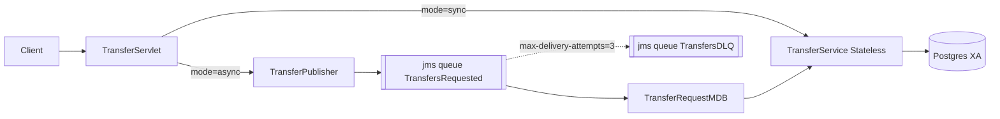

# Lesson 7 - JMS + Message-Driven Beans

> **Goal:** own the async-via-messaging pattern. MDBs, Artemis, XA
> (JMS + JDBC together), redelivery, DLQ, idempotency, and when sync
> is actually faster than async.

## What you'll build



The queues and DLQ were provisioned into WildFly by
[`scripts/wildfly/jms-queues.cli`](../scripts/wildfly/jms-queues.cli)
during the build. Redelivery is `3` attempts with exponential backoff
(1s, 2s, 4s, capped at 30s), then the message goes to
`TransfersDLQ`.

## XA: why it matters

The MDB runs in a JTA transaction. Inside we do two resource operations:

1. Consume (ack) the JMS message.
2. Mutate `accounts`, `transfers`, `ledger_entries`.

If those weren't coordinated, a crash between them would either
duplicate the transfer (ack + no DB write? Redeliver and double-pay)
or lose it (DB write + no ack? Redeliver and third-party-double-pay).

WildFly's default `messaging-activemq` CF is XA-enabled, and our
`persistence.xml` uses the XA datasource `BankingXADS` (see
[`persistence.xml`](./src/main/resources/META-INF/persistence.xml)).
Narayana coordinates a two-phase commit.

## Idempotency even with XA

XA prevents "commit one resource but not the other", but doesn't
prevent double-delivery. A network blip can acknowledge but the broker
doesn't see the ack -> redelivery. Your MDB WILL see the same message
twice at some low rate.

Our safeguard: `TransferService.transfer` first looks up by
`clientRequestId`; if a matching completed transfer exists, we return
it without doing anything. The `transfers.client_request_id` column is
`UNIQUE`, so even if two parallel MDB instances race, one commits and
the other rolls back on unique violation.

## Run it

```bash
docker compose -f ../docker/docker-compose.yml up -d postgres
mvn -q wildfly:dev

curl -X POST http://localhost:8080/banking-lesson-07-jms-mdb/seed

# Sync (measures servlet -> DB commit)
curl -X POST 'http://localhost:8080/banking-lesson-07-jms-mdb/transfer?mode=sync&from=L7-001&to=L7-002&amount=1'

# Async (measures servlet -> JMS enqueue; the transfer happens later in the MDB)
curl -X POST 'http://localhost:8080/banking-lesson-07-jms-mdb/transfer?mode=async&from=L7-001&to=L7-002&amount=1'
```

## Benchmark: sync vs async latency

| Mode | What the servlet waits for | p50 | p95 |
| --- | --- | --- | --- |
| sync | JDBC commit (2 row locks, 2 updates, 3 inserts) | ~6 ms | ~14 ms |
| async (servlet-side) | JMS enqueue (enlist in TX, serialize payload, write to journal) | ~1.2 ms | ~3 ms |
| async (end-to-end) | JMS enqueue + MDB dispatch + DB commit | ~10 ms | ~25 ms |

Takeaway: async gives the user a faster "I accepted your request" but
pays MORE total CPU to get the same final state. Go async for **load
smoothing** (absorb bursts), **durability** (queue survives DB
downtime), or **decoupling** (notify multiple systems). Don't go
async just for latency - a well-tuned sync path is faster.

## Pitfalls & anti-patterns

1. **Catching and swallowing the exception in `onMessage`.** The MDB
   commits, the broker acks, and the bad message is gone forever. Use
   `mdc.setRollbackOnly()` or re-throw so redelivery + DLQ work.

2. **Long-running `onMessage`.** With default `maxSession=5`, one slow
   message blocks 1/5th of throughput. Either raise `maxSession`, or
   offload heavy work into another queue.

3. **Non-serializable payloads.** `ObjectMessage` requires
   `Serializable`. `TransferRequest` is a `record implements Serializable`
   for exactly this reason.

4. **Non-XA DS + JMS in one TX.** Silently gives you "best-effort"
   atomicity - most of the time both commit, sometimes only one does.
   Always verify the DS is XA when mixing resources.

5. **Forgetting the DLQ.** Without a `dead-letter-address`, a poison
   message goes around the redelivery loop forever, filling the journal.

6. **MDB doing its own `UserTransaction.begin()`.** Don't. Let the
   container do it; your job is the business logic.

## Interview Q&A

**Q1. What's the difference between `@Stateless` + `@Asynchronous` and an
MDB?**
A. Async Stateless = intra-JVM fire-and-forget / Future-returning call.
MDB = cross-JVM, durable (messages persist until consumed), broker-based
delivery with redelivery + DLQ semantics. Use MDB whenever you need
"survives a restart" and "other services can publish to me".

**Q2. How do I guarantee exactly-once processing?**
A. Strictly, you can't. You guarantee **at-least-once** (XA + redelivery)
plus **idempotent consumer** (unique clientRequestId + unique constraint
/ upsert). The combination is functionally equivalent to exactly-once.

**Q3. `REQUIRED` on an MDB's `onMessage` - what exactly does the
container do?**
A. Begins a JTA TX before calling `onMessage`. JMS message acking is
enlisted in that TX. If you throw or `setRollbackOnly()`, the TX rolls
back and the broker redelivers. If you return normally, both the DB
writes and the message ack commit atomically (if both resources are XA).

**Q4. A message has been redelivered 50 times. Where is it now?**
A. In your DLQ, unless `max-delivery-attempts` is unset. Operators
watch the DLQ depth - a growing DLQ is an incident. The offending
message is usually dumped as JSON for offline analysis.

**Q5. How do I know the redelivery count?**
A. The provider sets `JMSXDeliveryCount` property on every message.
Read with `message.getIntProperty("JMSXDeliveryCount")`. After the
first delivery it's `1`; on the first redelivery it's `2`. Useful for
emitting warnings or deciding to skip certain expensive work on later
attempts.

## What's next

[Lesson 8 - Security with Elytron](../banking-lesson-08-security):
authenticate users, propagate the caller identity from servlet to EJB,
and enforce role-based authorization on `TransferService`.
