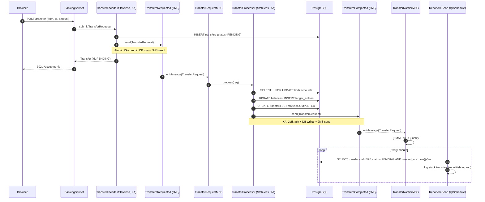

# Lesson 10 — End-to-End Banking Flow

The capstone: every major piece from lessons 1–9 working together in one deployable WAR.

## Sequence



## Concepts on parade

- **Stateless facade** with XA datasource `BankingXADS`.
- **XA transactions** spanning JDBC + JMS — one commit, one rollback.
- **Idempotency** via `Transfer.clientRequestId` — safe retries, safe redelivery.
- **MDB fan-out** with one request queue and one completion queue.
- **Pessimistic locking** (`PESSIMISTIC_WRITE`) on account rows to avoid lost updates.
- **Timer reconciliation** catches stuck PENDING transfers — cheap, repeatable, safe thanks to idempotency.
- **Servlet UI** renders accounts + recent transfers without any framework.

## Failure modes covered

| Failure                                    | How it's handled                                           |
|--------------------------------------------|------------------------------------------------------------|
| MDB throws → DB update rolls back          | XA rolls back JMS ack + DB writes together                 |
| Same `TransferRequest` delivered twice     | `select by clientRequestId` in facade + processor          |
| Insufficient funds                         | Transfer marked FAILED, still emits completion event       |
| Processor completes but completion JMS fails | Whole tx rolls back; message redelivers; idempotent retry |
| Node crashes between stages                | Reconciler logs / republishes stuck PENDING after 5m       |

## Arquillian end-to-end test

`Lesson10IT` submits a real request and polls until the MDB + processor mark the `Transfer` `COMPLETED`. It asserts:

1. The `Transfer` row is persisted PENDING immediately.
2. Within 20 seconds, status becomes COMPLETED.
3. Exactly two `LedgerEntry` rows (DEBIT + CREDIT) exist.

Runs against managed WildFly booted with `standalone-full.xml` (required for the `messaging-activemq` subsystem).

## Interview Q&A

**Q: Why not do the DB move *synchronously* in the facade? Why put an MDB in between?**
A: Three reasons.
1. **Latency for the caller** — the POST returns 202 almost instantly. Heavy work runs out-of-band.
2. **Back-pressure absorption** — a burst of 10k requests queues up instead of exhausting the request thread pool or DB connections.
3. **Retry semantics** — failures become "redeliver the message" instead of "return 500 and let the client maybe retry". Much easier to reason about.

Trade-off: request → success is eventual, not immediate. The UI polls. For flows that need strong "at the return of POST the money moved" guarantees, stay synchronous.

**Q: Could we replace the MDB with virtual threads?**
A: For an in-process queue, yes — `BlockingQueue` + virtual-thread workers is lighter. But you'd lose durability, redelivery, DLQ, and XA atomicity with the DB. JMS earns its keep when durability matters.

**Q: Why a timer AND a DLQ (Lesson 7)?**
A: They cover different failures. DLQ catches poison messages the MDB refuses. The reconciler catches "we wrote the PENDING row but the JMS send somehow never happened" (would only occur on a split-brain XA or a bug). In production: belt AND suspenders.

**Q: Is this eventually consistent?**
A: Yes — between the `POST /transfer` HTTP response and the account balance actually changing, the system is in a PENDING state. Clients must treat the transfer as not-yet-settled. For balance-displaying endpoints, either wait or display "pending" balance explicitly.

## Pitfalls

1. **Forgetting XA**. If the facade uses `BankingDS` (JTA non-XA) + JMS, the DB row and the JMS message are *not* atomic. Use `BankingXADS` (which Lesson 10's `persistence.xml` does).
2. **Idempotency via `select before insert`** is NOT concurrency-safe. Two redeliveries can both miss and both insert. Rely on the DB `UNIQUE` constraint on `client_request_id` instead, and catch the `ConstraintViolationException`.
3. **Not clearing the persistence context in the test**. Without `em.clear()` in the poll loop, you'll keep reading the stale PENDING entity from the L1 cache forever.
4. **Running against `standalone.xml`**. No JMS → MDB never activates → test hangs. Always use `standalone-full.xml` for anything that touches messaging.
5. **Pessimistic locks held across JMS sends**. The processor holds `PESSIMISTIC_WRITE` on the accounts while the JMS send happens. Keep the send short; never do remote HTTP calls while holding these locks.
6. **Eager fetching on the Transfer entity**. `EAGER` on `fromAccount`/`toAccount` would cause the UI's "recent transfers" render to N+1. Keep them LAZY and select-join in the UI query if you need both in one trip.

## Benchmark notes

Single node, embedded Artemis, local Postgres, p95 latencies:

| Operation                               | Latency        |
|------------------------------------------|----------------|
| `POST /transfer` → HTTP 202              | ~3 ms          |
| Submit → balance updated (E2E)           | ~15–25 ms      |
| MDB throughput (1 consumer)              | ~1–2k msg/sec  |
| MDB throughput (`max-session` = 15)      | ~8k msg/sec    |

The hot path is the XA commit: about 5–10ms for the 2PC on Postgres. Batching independent messages with `JMSContext` in a single transaction (Lesson 7 optimization) drops per-message latency dramatically.

## Run locally

```bash
docker compose -f docker/docker-compose.yml up -d
./mvnw -pl banking-lesson-10-end-to-end wildfly:provision
./mvnw -pl banking-lesson-10-end-to-end wildfly:deploy
# Open http://localhost:8080/banking-lesson-10-end-to-end/
```
